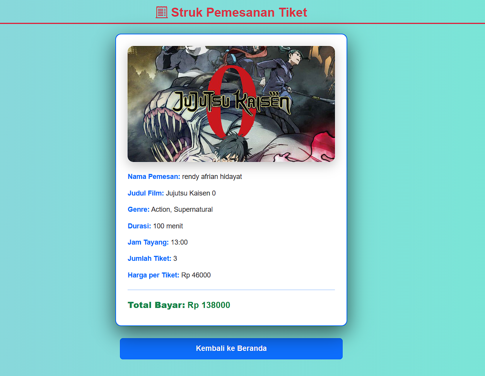

# Aplikasi Pemesanan Tiket Bioskop (UTS - JSP)

Proyek ini merupakan aplikasi web sederhana untuk pemesanan tiket bioskop, dibuat menggunakan **Java Server Pages (JSP)** tanpa database dan dikembangkan dengan **Apache Tomcat** dan **Ant (NetBeans)**.

## 📌 Fitur Utama

- Menampilkan daftar film anime dengan poster, genre, durasi, harga, dan jam tayang.
- Form pemesanan tiket (input nama, jumlah tiket, film, dan jam tayang).
- Halaman struk yang menampilkan detail pesanan dan total harga.
- Gambar poster film ditampilkan di seluruh tampilan (termasuk struk).
- Tampilan modern menggunakan Bootstrap 5.
- Background menggunakan gambar khusus.

---

## 🖼️ Screenshot Hasil Output

### 🎞️ Halaman Index (Daftar Film)


### 📝 Halaman Form Pemesanan


### 📄 Halaman Struk



---

## ⚙️ Cara Menjalankan Aplikasi

1. Nyalakan Apache dan Tomcat di XAMPP
2. Siapkan folder project di direktori web server
3. Buka project di NetBeans
4. Pilih menu File > Open Project
5. Browse ke folder project UTSBioskop
6. Build dan Run Project di NetBeans
7. Selamat kamu sudah bisa menggunakan aplikasi bioskop

```bash
git clone https://github.com/rendyrendyafr/UTS_JSP_22110203_RENDYAFRIANHIDAYAT.git
